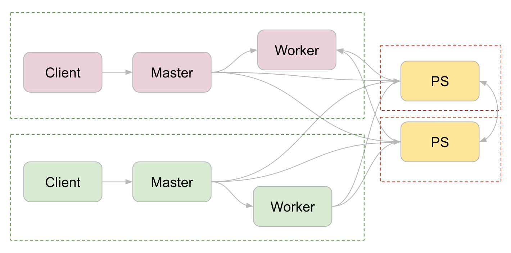

# TensorFlow Ecosystem

This repository contains examples for integrating TensorFlow with other
open-source frameworks. The examples are minimal and intended for use as
templates. Users can tailor the templates for their own use-cases.

If you have any additions or improvements, please create an issue or pull
request.

## Contents

- [docker](docker) - Docker configuration for running TensorFlow on
  cluster managers.
- [kubeflow](https://github.com/kubeflow/kubeflow) - A Kubernetes native platform for ML
	* A K8s custom resource for running distributed [TensorFlow jobs](https://github.com/kubeflow/kubeflow/blob/master/user_guide.md#submitting-a-tensorflow-training-job) 
	* Jupyter images for different versions of TensorFlow
	* [TFServing](https://github.com/kubeflow/kubeflow/blob/master/user_guide.md#serve-a-model-using-tensorflow-serving) Docker images and K8s templates
- [kubernetes](kubernetes) - Templates for running distributed TensorFlow on
  Kubernetes.
- [marathon](marathon) - Templates for running distributed TensorFlow using
  Marathon, deployed on top of Mesos.
- [hadoop](hadoop) - TFRecord file InputFormat/OutputFormat for Hadoop MapReduce
  and Spark.
- [spark-tensorflow-connector](spark/spark-tensorflow-connector) - Spark TensorFlow Connector
- [spark-tensorflow-distributor](spark/spark-tensorflow-distributor) - Python package that helps users do distributed training with TensorFlow on their Spark clusters.

## Distributed TensorFlow

See the [Distributed TensorFlow](https://www.tensorflow.org/deploy/distributed)
documentation for a description of how it works. The examples in this
repository focus on the most common form of distributed training: between-graph
replication with asynchronous updates.

### Common Setup for distributed training

Every distributed training program has some common setup. First, define flags so
that the worker knows about other workers and knows what role it plays in
distributed training:

```python
# Flags for configuring the task
flags.DEFINE_integer("task_index", None,
                     "Worker task index, should be >= 0. task_index=0 is "
                     "the master worker task the performs the variable "
                     "initialization.")
flags.DEFINE_string("ps_hosts", None,
                    "Comma-separated list of hostname:port pairs")
flags.DEFINE_string("worker_hosts", None,
                    "Comma-separated list of hostname:port pairs")
flags.DEFINE_string("job_name", None, "job name: worker or ps")
```

Then, start your server. Since worker and parameter servers (ps jobs) usually
share a common program, parameter servers should stop at this point and so they
are joined with the server.

```python
# Construct the cluster and start the server
ps_spec = FLAGS.ps_hosts.split(",")
worker_spec = FLAGS.worker_hosts.split(",")

cluster = tf.train.ClusterSpec({
    "ps": ps_spec,
    "worker": worker_spec})

server = tf.train.Server(
    cluster, job_name=FLAGS.job_name, task_index=FLAGS.task_index)

if FLAGS.job_name == "ps":
  server.join()
```

Afterwards, your code varies depending on the form of distributed training you
intend on doing. The most common form is between-graph replication.

### Between-graph Replication

In this mode, each worker separately constructs the exact same graph. Each
worker then runs the graph in isolation, only sharing gradients with the
parameter servers. This set up is illustrated by the following diagram. Please
note that each dashed box indicates a task.


You must explicitly set the device before graph construction for this mode of
training. The following code snippet from the
[Distributed TensorFlow tutorial](https://www.tensorflow.org/deploy/distributed)
demonstrates the setup:

```python
with tf.device(tf.train.replica_device_setter(
    worker_device="/job:worker/task:%d" % FLAGS.task_index,
    cluster=cluster)):
  # Construct the TensorFlow graph.

# Run the TensorFlow graph.
```

### Requirements To Run the Examples

To run our examples, [Jinja templates](http://jinja.pocoo.org/) must be installed:

```sh
# On Ubuntu
sudo apt-get install python-jinja2

# On most other platforms
sudo pip install Jinja2
```

Jinja is used for template expansion. There are other framework-specific
requirements, please refer to the README page of each framework.
