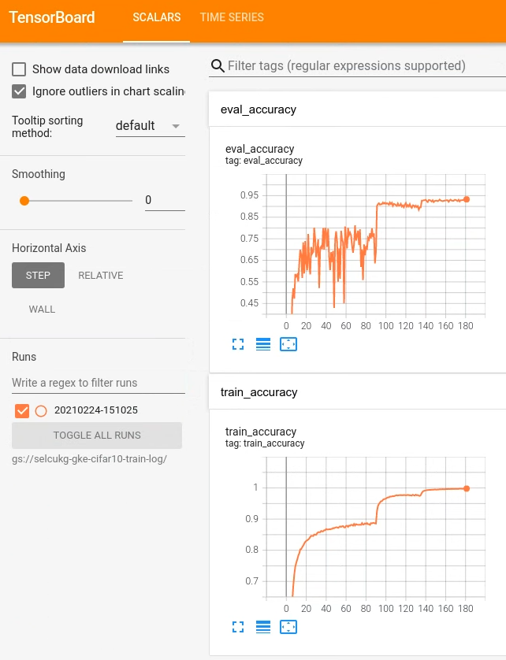

# Parameter Server Training Using Distribution Strategies

This directory provides an example of running parameter server training with
Distribution Strategies.

Please first read the
[documentation](https://www.tensorflow.org/tutorials/distribute/parameter_server_training)
of Distribution Strategy for parameter server training. We also assume that readers
of this page  are familiar with [Google Cloud](https://cloud.google.com/) and
its [Kubernetes Engine](https://cloud.google.com/kubernetes-engine/).

This directory contains the following files:

-   kubernetes/template.yaml.jinja: jinja template used for generating Kubernetes manifests
-   kubernetes/render_template.py: script for rendering the jinja template
-   Dockerfile.resnet_cifar_ps_strategy: a docker file to build the model image
-   resnet_cifar_ps_strategy.py: script for running any type of parameter server training task based on `TF_CONFIG` environment variable

## Prerequisites

1.  First you need to have a Google Cloud project. Either create a new project or use an existing one. 

2.  Install
    [gcloud commandline tools](https://cloud.google.com/functions/docs/quickstart)
    on your system, login, set project and zone, etc.

3.  Install [Docker](https://docs.docker.com/get-docker/) for your system 

4.  Install kubectl:

    ```bash
    gcloud components install kubectl
    ```
5.  Start a Kubernetes cluster either with `gcloud` command as shown below or with
    [GKE](https://cloud.google.com/kubernetes-engine/) web UI. Using more CPUs or nodes may require increasing your CPU [quotas](https://cloud.google.com/compute/quotas#requesting_additional_quota). 
    
    ```bash
    gcloud container clusters create <cluster_name> --zone=us-west1-a --num-nodes=6 --machine-type=e2-standard-4 
    ```

6.  Set context for `kubectl` so that `kubectl` knows which cluster to use:

    ```bash
    kubectl config use-context <cluster_name>
    ```

7. Create a
    [service account](https://cloud.google.com/compute/docs/access/service-accounts) 
    and download its key file in JSON format. Assign Storage Admin role for 
    [Google Cloud Storage](https://cloud.google.com/storage/) to this service account:

    ```bash
    gcloud iam service-accounts create <service_account_id> --display-name="<display_name>"
    ```

    ```bash
    gcloud projects add-iam-policy-binding <project-id> \
    --member="serviceAccount:<service_account_id>@<project_id>.iam.gserviceaccount.com" \
    --role="roles/storage.admin"
    ```

8.  Create a Kubernetes secret from the JSON key file of your service account:

    ```bash
    kubectl create secret generic credential --from-file=key.json=<path_to_json_file>
    ```

9. Enable GCR ([Google Container Registry](https://cloud.google.com/container-registry)) service for your project using either GCP web UI or gcloud tool:

    ```bash
    gcloud services enable containerregistry.googleapis.com
    ```

10. Configure Docker to authenticate with Container Registry

    ```bash
    gcloud auth configure-docker
    ```
## How to run the example

1.  Create three buckets for model data, checkpoints and training logs using either GCP web UI or gsutil tool (included with the gcloud tool you have installed above):

    ```bash
    gsutil mb gs://<bucket_name>
    ```
    You will use these bucket names to modify `data_dir`, `checkpoint_dir` and `train_log_dir` in step #4.


2. Download CIFAR-10 data and place them in your data_dir bucket. Head to the [ResNet in TensorFlow](https://github.com/tensorflow/models/tree/r1.13.0/official/resnet#cifar-10) directory to obtain CIFAR-10 data. Alternatively, you can use this [direct link](https://www.cs.toronto.edu/~kriz/cifar-10-binary.tar.gz) to download and extract the data yourself as well. 
    
    ```bash
    python cifar10_download_and_extract.py
    ```

    Upload the contents of cifar-10-batches-bin directory to your `data_dir` bucket.

    ```bash
    gsutil -m cp cifar-10-batches-bin/* gs://<your_data_dir>/

    ```

3.  Now let's build the Docker image:

    ```bash
    docker build --no-cache -t resnet_cifar_ps_strategy:v1 -f Dockerfile.resnet_cifar_ps_strategy .

    ```

    and push the image to
    [Google Cloud Container Registery](https://cloud.google.com/container-registry/):

    ```bash
    docker tag resnet_cifar_ps_strategy:v1 gcr.io/<your project>/resnet_cifar_ps_strategy:v1
    docker push gcr.io/<your project>/resnet_cifar_ps_strategy:v1
    ```

4.  Modify the variables in template.yaml.jinja. You may want to change `name`,
    `image`, `train_log_dir`, `script` and `cmdline_args`.

    *   `name`: name your cluster, e.g. "my-parameter-server-example".
    *   `image`: the name of your docker image.
    *   `worker_replicas`: number of worker pods. 
    *   `ps_replicas`: number of parameter server pods.
    *   `num_gpus_per_worker`: number of GPUs (this does not apply for this example since parameter server distribution strategy does not have GPU support yet) 
    *   `has_coordinator`: flag for creating coordinator job
    *   `has_eval`: flag for creating evaluator job (this is set to False in the default template in order to use inline distributed evaluation. Setting this flag to True enables side-car evaluation.)
    *   `has_tensorboard`: flag for creating tensorboard job
    *   `script`: the script in the docker image to run.
    *   `train_log_dir`: used for logging training accuracy
    *   `cmdline_args`: the command line arguments passed to the `script`.
    *   `credential_secret_json`: the filename that was registered to Kubernetes as a secret. 
    *   `credential_secret_key`: the name of the Kubernetes secret used for storing
        your service account key.
    *   `port`: the port for all tasks including tensorboard.
    *   `use_node_port`: flag for using NodePort as type of service. Jinja template generates ingress only for tensorboard when this flag is set to `true`. Setting this flag to `false` enables LoadBalancer for all pods; assigning them external IPs (which may be limited by your public IP address quota).  

5.  Start the training and evaluation on the cluster.
    
    You may want to verify the generated kubernetes manifests by running the following:

    ```bash
    cd kubernetes
    python render_template.py template.yaml.jinja | kubectl create -f - --dry-run=client
    ```

    After making sure that the above command succeeds, you can start the cluster (removing the dry-run flag):

    ```bash
    python render_template.py template.yaml.jinja | kubectl create -f -
    ```
    You'll see that your cluster has started training. You can inspect logs of
    workers or use tensorboard to watch your model training.

    ```bash
    kubectl get pods
    ```

    ```bash
    kubectl logs -f <pod_id>
    ```

6.  You can find the TensorBoard service public IP address on Services & Ingress page of GKE, and access TensorBoard on  http://<tensorboard_ip> (or http://<tensorboard_ip>:5000 if you have set `use_node_port` to `false`)using your browser.  
    
    The training accuracy graph shall look like the following:

    

7. Destroy the cluster
    
    ```bash
    gcloud container clusters delete <cluster_name>
    ```

