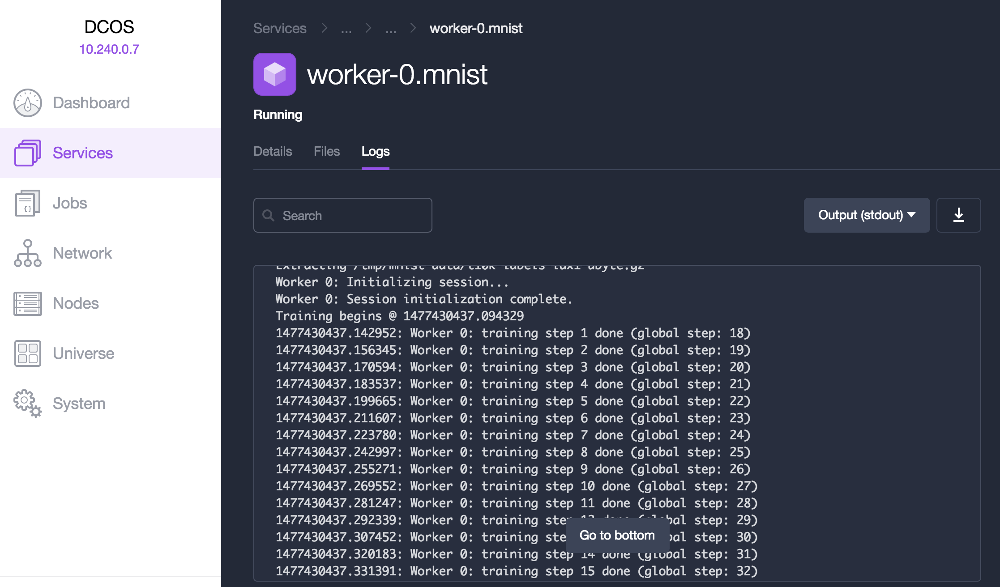

# Running Distributed TensorFlow on Mesos/Marathon

## Prerequisite
Before you start, you need to set up a Mesos cluster with Marathon installed and Mesos-DNS enabled. It is also preferable to set up some shared storage such as HDFS in the cluster. All of these could be easily installed and configured with the help of [DC/OS](https://dcos.io/docs/1.9/administration/installing/custom/gui/). You need to remember the master target, DNS domain and HDFS namenode which are needed to bring up the TensorFlow cluster.

## Write the Training Program
This section covers instructions on how to write your training program and build your docker image.

 1. Write your own training program. This program must accept `worker_hosts`, `ps_hosts`, `job_name`, `task_index` as command line flags which are then parsed to build `ClusterSpec`. After that, the task either joins with the server or starts building graphs. Please refero to the [main page](../README.md) for code snippets and description of between-graph replication. An example can be found in `docker/mnist.py`.

   In the case of large training input is needed by the training program, we recommend copying your data to shared storage first and then point each worker to the data. You may want to add a flag called `data_dir`. Please refer to the [adding flags](#add-commandline-flags) section for adding this flag into the marathon config.

 2. Write your own Docker file which simply copies your training program into the image and optionally specify an entrypoint. An example is located in `docker/Dockerfile` or `docker/Dockerfile.hdfs` if you need the HDFS support. TensorBoard can also use the same image, but with a different entry point.

 3. Build your docker image, push it to a docker repository:

  ```sh
  cd docker
  docker build -t <image_name> -f Dockerfile.hdfs .
  # Use gcloud docker push instead if on Google Container Registry.
  docker push <image_name>
  ```
  Please refer to [docker images](../docker/README.md) page for best practices of building docker images.


## Generate Marathon Config
The Marathon config is generated from a Jinja template where you need to customize your own cluster configuration in the file header.

 1. Copy over the template file:

  ```sh
  cp marathon/template.json.jinja mycluster.json.jinja
  ```

 2. Edit the `mycluster.json.jinja` file. You need to specify the `name`, `image_name`, `train_dir` and optionally change number of worker and ps replicas. The `train_dir` must point to the directory on shared storage if you would like to use TensorBoard or sharded checkpoint.  

 3. Generate the Marathon json config:

  ```sh
  python render_template.py mycluster.json.jinja > mycluster.json
  ```

## Start the Tensorflow Cluster
To start the cluster, simply post the Marathon json config file to the Marathon master target which is `marathon.mesos:8080` by default:

  ```sh
  curl -i -H 'Content-Type: application/json' -d @mycluster.json http://marathon.mesos:8080/v2/groups
  ```

You may want to make sure your cluster is running the training program correctly. Navigate to the DC/OS web console and look for stdout or stderr of the chief worker. The `mnist.py` example would print losses for each step and final loss when training is done.



If TensorBoard is enabled, navigate to `tensorboard.marathon.mesos:6006` with your browser or find out its IP address from the DC/OS web console.


## Add Commandline Flags

Let's suppose you would like to add a flag called `data_dir` into the rendered config. Before rendering the template, make following changes:

 1. Add a variable in the header of `mycluster.json.jinja`:
  ```
    
  ```  

 2. Add the flag into the `args` section of the template:
   ```
   # replace "args": ["--worker_hosts", ...] with  
   "args": ["--data_dir", {{ data_dir}}, --worker_hosts", ...]  
   ```  
